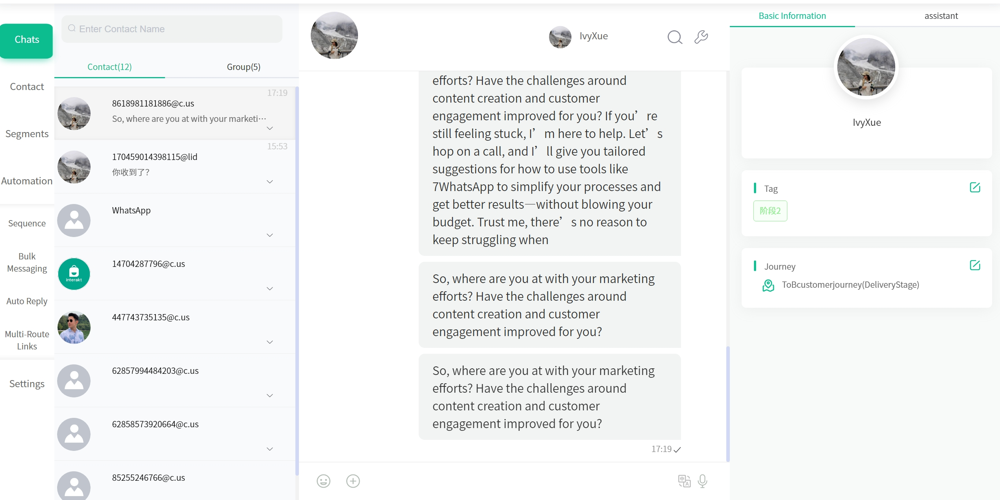
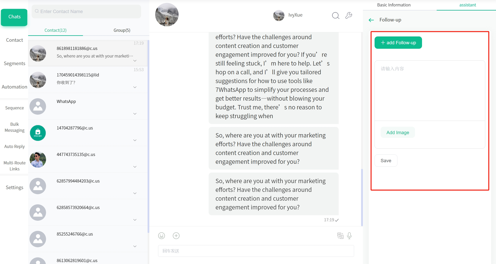
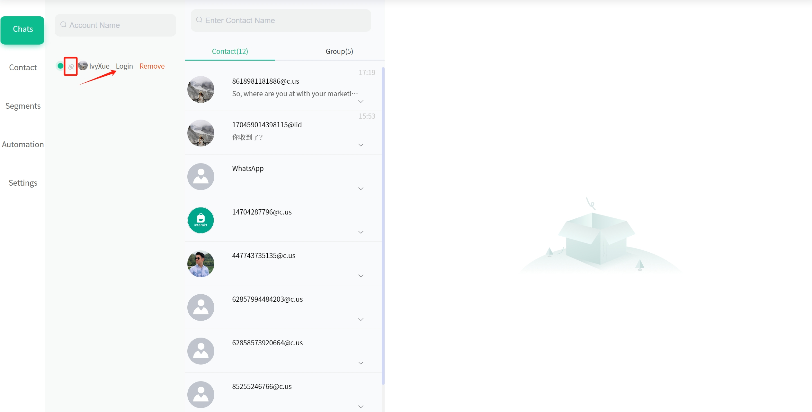

# 聊天会话

## 使用场景

聊天会话是进行客户沟通的核心工作区域。在这里可以统一管理多个 WhatsApp 账号的对话，查看客户完整信息，记录跟进内容，提高沟通效率。

## 功能介绍

### 会话列表管理

左侧会话列表展示了所有的联系人和群组对话：

- 支持按名称搜索联系人
- 可切换查看个人联系人或群组会话
- 显示最新消息预览和时间
- 未读消息提醒
- 支持多个 WhatsApp 账号的会话统一管理

### 对话界面

中间的对话界面是进行沟通的主要区域：

- 支持发送文字、表情、图片等多种类型消息
- 支持中英文内容翻译
- 支持语音输入

### 客户信息面板

右侧信息面板整合展示了当前对话客户的重要信息：

- 基础信息：头像、名称、手机号等
- 标签管理：可添加、删除标签
- 旅程状态：显示客户当前所处的营销旅程阶段
- 跟进记录：
  - 可添加跟进内容和图片附件
  - 记录重要沟通要点
  - 便于团队协作和客户管理

## 使用技巧

1. 使用标签对客户进行分类管理，方便后续筛选和群发
2. 及时添加跟进记录，记录重要信息
3. 关注客户旅程状态，进行针对性沟通
4. 使用快捷回复提高回复效率
5. 定期整理会话列表，保持工作区域整洁

## 注意事项

请保持 WhatsApp 网页端账号在线，以确保消息及时收发。当链接标识变成灰色，说明网页端账号离线。

