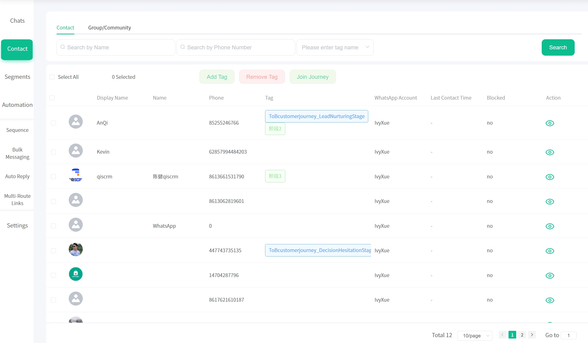
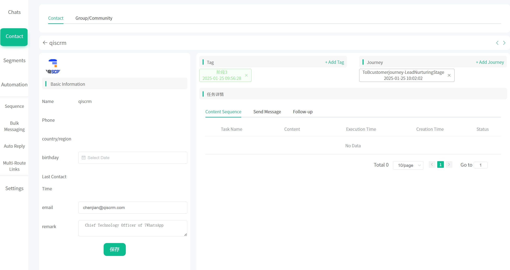
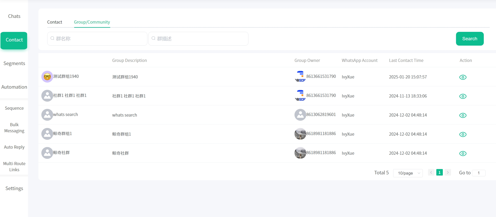
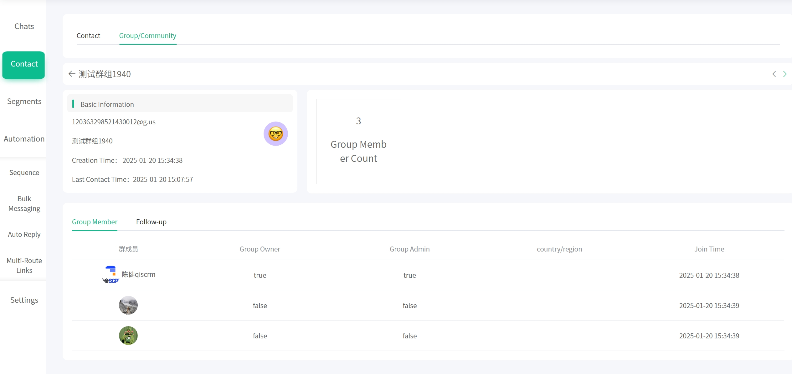

# 联系人

该列表获取了登录到系统后台所有 WhatsApp 账号的联系人数据，可以统一管理。支持批量打标签，设置旅程

从列表的眼睛图标进入，可以查看每个用户的画像信息，包括：用户基础信息，标签，旅程现状，以及所有对该用户的触达历史：比如内容序列，群发消息等。

# 社群

该列表获取了登录到系统后台所有 WhatsApp 账号的社群数据。

从列表的眼睛图标进入，可以查看每个社群/群组的画像信息，包括：社群基础信息，成员人数，群成员详情列表和跟进笔记。

